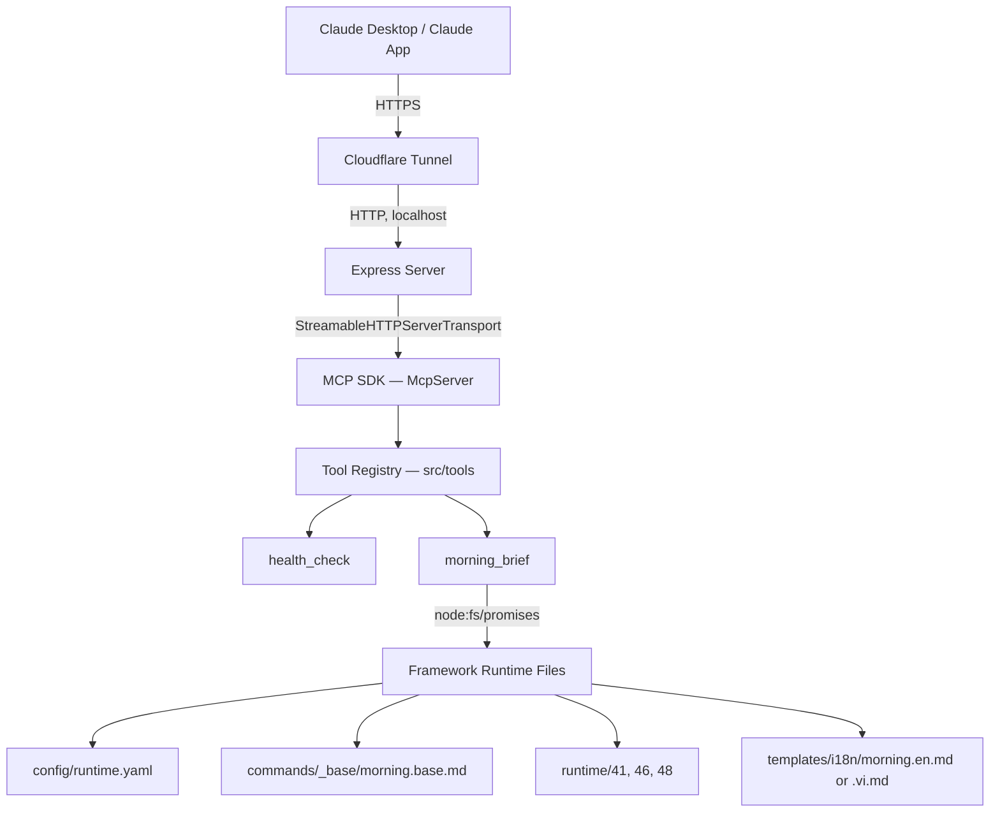
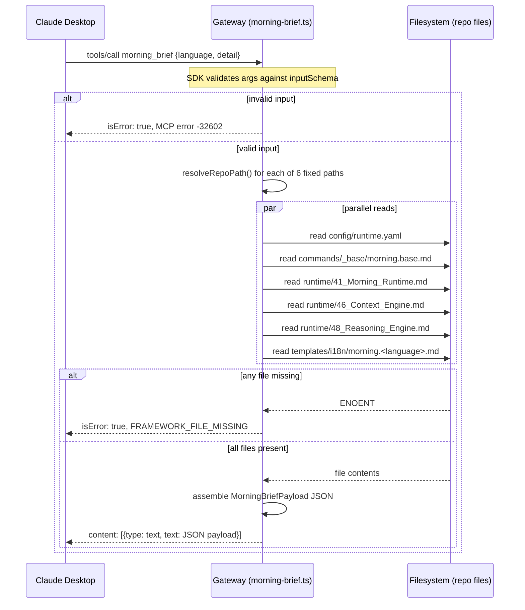

# MCP Gateway — Operations Handbook

Version: 1.0 (covers Phase 1: `health_check`, `morning_brief`)

Companion to: `runtime/50_Remote_Gateway.md` (spec of record for phase status), `apps/mcp-gateway/ARCHITECTURE.md` (stable design conventions), `apps/mcp-gateway/ROADMAP.md` (phase plan).

Audience: an engineer who has never seen this project, who needs to run, verify, debug, or extend the gateway today.

---

## Table of Contents

1. [Purpose](#1-purpose)
2. [Architecture Overview](#2-architecture-overview)
3. [Repository Structure](#3-repository-structure)
4. [Local Development](#4-local-development)
5. [Running the Gateway](#5-running-the-gateway)
6. [Verifying the Gateway](#6-verifying-the-gateway)
7. [Cloudflare Tunnel](#7-cloudflare-tunnel)
8. [Claude Desktop Connector](#8-claude-desktop-connector)
9. [Morning Brief Tool](#9-morning-brief-tool)
10. [Health Check Tool](#10-health-check-tool)
11. [Testing](#11-testing)
12. [Troubleshooting](#12-troubleshooting)
13. [Operational Checklist](#13-operational-checklist)
14. [Security](#14-security)
15. [Future Roadmap](#15-future-roadmap)
16. [Engineering Principles](#16-engineering-principles)
17. [Lessons Learned](#17-lessons-learned)

---

## 1. Purpose

### Why the gateway exists

The Personal AI Operating System (this repository) is a Markdown knowledge and workflow framework: handbooks (`handbook/`), runtime specs (`runtime/`), commands (`commands/`), and output templates (`templates/`). Until this component existed, the only way to use that framework was through an AI client that had the repository open locally — Claude Code, running inside this checkout, reading these files directly off disk.

That model breaks the moment you want to use the framework from anywhere the repository isn't checked out — a phone, a browser, any AI client that only speaks a network protocol. The gateway exists to close that gap: it is a small network service that exposes parts of this framework over the **Model Context Protocol (MCP)**, so a remote AI client (starting with the Claude App) can reach it without having filesystem access to this repository.

### What problem it solves, concretely

Before the gateway: "say Morning and get a Morning Brief" from the Claude App was not possible, because the Claude App cannot read `commands/_base/morning.base.md` or `runtime/41_Morning_Runtime.md` off your disk. After Phase 1: the Claude App can call a tool named `morning_brief`, and the gateway hands back the contents of those files (plus the matching output template) as a single structured payload the app's model can follow.

### Current responsibilities (Phase 1)

- Serve two MCP tools over Streamable HTTP: `health_check` and `morning_brief`.
- Read a fixed, hardcoded allowlist of Markdown/YAML files from this repository and return their raw contents.
- Validate tool input (`language`, `detail`) before doing any file I/O.
- Report errors in a structured, predictable shape when something goes wrong (bad input, missing file, internal error).

### Non-responsibilities (explicitly, as of Phase 1)

- **Does not call any external system.** No Jira, no Outlook, no Calendar, no Microsoft Graph, no database. Verified by source scan — see [§11 Testing](#11-testing).
- **Does not execute the Morning workflow.** It does not decide priorities, does not reason about calendar/Jira/email content, does not produce a finished brief. It returns the *ingredients* (framework files); the calling AI client's model does the reasoning, exactly as Claude Code does today when it reads these files locally.
- **Does not authenticate callers.** Anyone who can reach the `/mcp` endpoint can call both tools. This is a deliberate, documented Phase 1 limitation — see [§14 Security](#14-security).
- **Does not persist any state.** Every request is independent; there is no session, no database, no cache.

---

## 2. Architecture Overview

### Request path



### Layer-by-layer explanation

**Claude Desktop / Claude App.** The MCP client. It holds a "custom connector" configuration pointing at a public HTTPS URL (`https://<tunnel-host>/mcp`). When its model decides a tool is relevant to the conversation, it sends a JSON-RPC request to that URL.

**Cloudflare Tunnel.** Claude's connector configuration requires HTTPS ([§8](#8-claude-desktop-connector)). The gateway itself only speaks plain HTTP and only binds to `localhost` during local development — there is no TLS termination or public listener built into the gateway. `cloudflared` bridges that gap: it opens an outbound connection from your machine to Cloudflare's edge and gives you a public `https://*.trycloudflare.com` URL that forwards to `http://localhost:3000`. See [§7](#7-cloudflare-tunnel) for the full explanation of why this exists and its limitations.

**Express Server** (`src/server.ts`). Plain HTTP layer. Exactly two routes matter: `GET /health` (a monitoring endpoint, not part of MCP) and `POST /mcp` (the actual protocol endpoint). `GET /mcp` and `DELETE /mcp` are explicitly registered to return `405 Method Not Allowed` — see [§6](#6-verifying-the-gateway) for why. `server.ts` contains no tool logic; it only wires HTTP to the MCP SDK.

**MCP SDK — `McpServer`** (`@modelcontextprotocol/sdk`). Speaks the MCP protocol: `initialize`, `tools/list`, `tools/call`, and the underlying JSON-RPC 2.0 envelope. Transport is `StreamableHTTPServerTransport` in **stateless mode** (`sessionIdGenerator: undefined`) — every `POST /mcp` request gets a brand-new `McpServer` instance and a brand-new transport (see `createApp()` in `src/server.ts`). There is no session that persists between requests. This is why the gateway currently cannot push server-initiated notifications and why `GET`/`DELETE /mcp` (which exist in the spec to manage a persistent session's SSE stream) have nothing to serve.

**Tool Registry** (`src/tools/index.ts`). The single place that assembles every tool the gateway exposes. `buildMcpServer()` constructs one `McpServer` and calls `registerHealthCheck(server)` then `registerMorningBrief(server)`. This function runs once per incoming `POST /mcp` request (because the server itself is stateless and rebuilt per request).

**Tools** (`src/tools/health-check.ts`, `src/tools/morning-brief.ts`). Each file owns one tool: its name, description, input schema (Zod), and handler function. Neither tool file knows anything about Express or HTTP — they only know the MCP SDK's `registerTool` API.

**Framework Runtime Files.** The actual content being served. `morning_brief` reads a fixed set of files from this repository (listed in [§9](#9-morning-brief-tool)) using `node:fs/promises.readFile`, resolved through a path-safety helper (`src/lib/repo-paths.ts`) that refuses to resolve outside the repository root.

### Why this shape, not something else

The gateway is deliberately "dumb" at this phase: it is a context-loading proxy, not a reasoning engine. `commands/_base/morning.base.md` remains the single source of workflow logic (loaded and returned, never reimplemented) — Claude Code today and the Claude App via this gateway both end up following the exact same instructions. This is a load-bearing design decision, not an oversight: see `apps/mcp-gateway/ARCHITECTURE.md` §3 and the "What Stays Stable" section.

---

## 3. Repository Structure

This section covers `apps/mcp-gateway/` in full, plus the parts of the repository root it depends on.

```
apps/mcp-gateway/
├── ARCHITECTURE.md          Stable design conventions (naming, errors, folders, versioning).
├── ROADMAP.md                Phase plan (0 → 0.5 → 1 → 2 → 3 → 4), what shipped in each.
├── package.json               Scripts, dependencies. type: "module" (ESM throughout).
├── package-lock.json
├── tsconfig.json               ES2022 target, Node16 module resolution, strict mode.
├── .gitignore                   Ignores dist/ (node_modules/ is covered by the repo root .gitignore).
├── docs/
│   └── manual-test-claude-app.md   Step-by-step human test: connect Claude App, verify health_check.
├── src/
│   ├── index.ts                 Process entry point. Reads PORT env var, starts the HTTP listener.
│   ├── server.ts                 createApp(): Express wiring only. GET /health, POST /mcp, 405s.
│   ├── tools/
│   │   ├── index.ts               buildMcpServer() — assembles every tool. The only file server.ts imports from this folder.
│   │   ├── health-check.ts        registerHealthCheck(). Owns SERVICE_NAME/SERVICE_VERSION/HEALTH_PAYLOAD.
│   │   └── morning-brief.ts       registerMorningBrief() + the exported pure loadMorningBriefPayload() function.
│   ├── schemas/
│   │   └── framework/
│   │       └── morning-brief.input.ts   Zod input schema + inferred TS type for morning_brief.
│   ├── types/
│   │   └── error-envelope.ts     Tool-level error format (ErrorCode union + buildErrorResult()).
│   └── lib/
│       └── repo-paths.ts          REPO_ROOT constant + resolveRepoPath() containment check.
└── tests/
    ├── gateway.test.ts             All 10 automated tests (see §11).
    └── fixtures/
        └── missing-file-repo/       A deliberately incomplete mirror of the framework file layout, used only to test the missing-file error path. Omits runtime/48_Reasoning_Engine.md on purpose.
```

### What each directory is *for*, not just what's in it

- **`src/tools/`** is the MCP-facing surface. If you are adding a new tool, this is where its registration function goes. One file per tool, `kebab-case.ts`, exporting `register<PascalCaseName>(server)`.
- **`src/schemas/`** validates tool input before any tool logic runs. Organized `schemas/<domain>/<action>.input.ts` — `framework/` is the domain for tools that serve this repository's own files. A future `schemas/jira/` would hold Jira-tool schemas.
- **`src/types/`** holds only cross-cutting types used by more than one domain. `error-envelope.ts` qualifies because every tool (present and future) uses the same error shape. A Jira-specific type would not go here.
- **`src/lib/`** holds infrastructure helpers with no MCP or domain awareness — currently just safe path resolution.
- **`tests/fixtures/`** holds static, version-controlled input data for tests that need a controlled filesystem state (as opposed to `tests/gateway.test.ts`'s in-process HTTP server, which needs no fixture).

### What does not exist yet (see §15)

`src/adapters/` (external system integrations) and a populated `src/schemas/<external-domain>/` do not exist. Do not create them speculatively — `apps/mcp-gateway/ARCHITECTURE.md` §8/§9 states these folders are created at the moment the first adapter is actually built, not before.

### Repository-root dependencies

The gateway does not vendor or copy any framework file — it reads them live, every request, from these repository-root paths:

| Path | Role |
|---|---|
| `config/runtime.yaml` | Timezone/locale/output config, returned as-is (not parsed). |
| `commands/_base/morning.base.md` | The shared Morning workflow logic. |
| `runtime/41_Morning_Runtime.md` | Morning Runtime spec. |
| `runtime/46_Context_Engine.md` | Context selection engine spec. |
| `runtime/48_Reasoning_Engine.md` | Reasoning/prioritisation engine spec. |
| `templates/i18n/morning.en.md` | English output template. |
| `templates/i18n/morning.vi.md` | Vietnamese output template. |

If any of these paths are renamed or moved, `morning_brief` breaks immediately (by design — it fails loudly with `FRAMEWORK_FILE_MISSING`, it does not silently serve stale or partial content). See [§9](#9-morning-brief-tool) and [§12](#12-troubleshooting).

---

## 4. Local Development

### Prerequisites

| Tool | Verified version | Check with |
|---|---|---|
| Node.js | v22.22.2 (repository developed against Node 22; `@types/node` pinned to `^22.10.0`) | `node --version` |
| npm | ships with Node | `npm --version` |
| A POSIX shell | macOS/Linux (this handbook assumes macOS, matching the current operational environment) | — |

Node is **not** installed by this repository. If it's missing:

```bash
# macOS, via Homebrew
brew install node@22

# or via nvm (works on macOS/Linux, recommended if you manage multiple Node versions)
curl -o- https://raw.githubusercontent.com/nvm-sh/nvm/v0.40.1/install.sh | bash
nvm install 22
nvm use 22
```

### Clone and install

```bash
cd /path/to/Personal-AI-Operating-System
cd apps/mcp-gateway
npm install
```

**Why `cd apps/mcp-gateway` first, and not `npm install` from the repo root:** the repository root is deliberately package-less (`ARCHITECTURE.md` §"What Stays Stable" — no workspace conversion). `apps/mcp-gateway` is a fully self-contained npm package; there is no root `package.json` to install against.

Expected output ends with something like:

```
added 92 packages, and audited 93 packages in 2s
found 0 vulnerabilities
```

Exact package count will drift as dependencies update; "0 vulnerabilities" and no error lines are what to actually check.

### Verify the toolchain before writing any code

```bash
npm run typecheck
```

Expected: no output at all (a silent `tsc --noEmit` exit-0 means success — this is normal TypeScript behavior, not a hang).

```bash
npm test
```

Expected (Phase 1 baseline):

```
 RUN  v3.2.7 .../apps/mcp-gateway

 ✓ tests/gateway.test.ts (10 tests) 91ms

 Test Files  1 passed (1)
      Tests  10 passed (10)
```

If both of these pass on a fresh clone, your environment is correctly set up. If either fails on a clean checkout with no local changes, stop and treat it as an environment problem, not a code problem — see [§12](#12-troubleshooting).

---

## 5. Running the Gateway

### Start in development mode

```bash
cd apps/mcp-gateway
npm run dev
```

This runs `tsx src/index.ts` — `tsx` executes the TypeScript entry point directly, no separate build step, with fast reload characteristics suitable for iterative work. It is **not** what you'd run in a production deployment (see `npm run build` / `npm start` below).

### Expected output

```
ai-operating-system-mcp-gateway v0.1.0 listening on port 3000
  MCP endpoint:  POST http://localhost:3000/mcp
  Health check:  GET  http://localhost:3000/health
```

This is the entirety of `src/index.ts`'s console output — there is no per-request access logging yet (see `ARCHITECTURE.md` §6, logging is explicitly deferred past Phase 1).

### Port

Default: **3000**. Controlled by the `PORT` environment variable:

```bash
PORT=3123 npm run dev
```

There is no config file for this — `src/index.ts` reads `process.env.PORT` directly with a fallback of `3000`.

### Expected startup failures

**Port already in use:**

```
Error: listen EADDRINUSE: address already in use :::3000
```

Node's default behavior for this is to throw an unhandled exception and exit — `npm run dev` will exit with a non-zero code and the `tsx`/`node` stack trace will be visible. There is no graceful "pick another port" fallback built in. Resolution: pick a different `PORT`, or find and stop whatever is already bound to 3000 (see [§12](#12-troubleshooting)).

**TypeScript compile error in `src/`:** `tsx` will refuse to start and print the compiler error to stderr, e.g. a type mismatch. Nothing binds to any port in this case — there is no partially-started state to clean up.

### Building for a persistent/production-style run

```bash
npm run build     # tsc — compiles src/ to dist/ per tsconfig.json
npm start          # node dist/index.js
```

`npm run build` produces `dist/index.js` and friends (git-ignored — see `apps/mcp-gateway/.gitignore`). Use this path if you want to run the gateway without `tsx` in the loop (e.g. under a process manager). As of Phase 1 there is no Dockerfile, no systemd unit, no process manager configuration checked in — "deployment story" is explicitly a Phase 3 non-goal (`ROADMAP.md` Phase 3).

### How to restart

There is no hot-reload and no supervisor process. To restart after a code change under `npm run dev`:

1. `Ctrl+C` in the terminal running `npm run dev`.
2. Confirm the port is free (see [§12](#12-troubleshooting) "port already in use" if unsure).
3. `npm run dev` again.

### How to verify it actually started

Don't trust the console log alone — confirm the port is actually accepting connections:

```bash
curl -s http://localhost:3000/health
```

Expected:

```json
{"status":"ok","service":"ai-operating-system-mcp-gateway","version":"0.1.0"}
```

If this hangs or connection-refuses, the process did not actually bind — see [§12](#12-troubleshooting).

---

## 6. Verifying the Gateway

Every command below was run against a live instance of the Phase 1 gateway; outputs are copied verbatim (formatting/line-wrapping added only for readability), not invented.

### 6.1 — Health

```bash
curl -s http://localhost:3000/health
```

```json
{"status":"ok","service":"ai-operating-system-mcp-gateway","version":"0.1.0"}
```

**What this verifies:** the Express process is up and its most trivial route works. It does **not** verify the MCP layer at all — `/health` is a plain REST endpoint outside the MCP protocol, deliberately kept simple so uptime monitors don't need to speak MCP.

### 6.2 — `initialize`

Every MCP session begins with an `initialize` call — this is the protocol handshake, not gateway-specific.

```bash
curl -s -X POST http://localhost:3000/mcp \
  -H "Content-Type: application/json" \
  -H "Accept: application/json, text/event-stream" \
  -d '{
    "jsonrpc": "2.0",
    "id": 1,
    "method": "initialize",
    "params": {
      "protocolVersion": "2025-03-26",
      "capabilities": {},
      "clientInfo": { "name": "curl", "version": "0.0.0" }
    }
  }'
```

```
event: message
data: {"result":{"protocolVersion":"2025-03-26","capabilities":{"tools":{"listChanged":true}},"serverInfo":{"name":"ai-operating-system-mcp-gateway","version":"0.1.0"}},"jsonrpc":"2.0","id":1}
```

**What this verifies:** the MCP SDK layer is wired correctly (not just Express), and confirms the negotiated `capabilities.tools.listChanged: true` — the server declares it supports tool listing, which is what makes `tools/list` valid next.

**Note on response format:** the body is `text/event-stream` framed (`event: message\ndata: {...}`) even though this is a single-shot, non-streaming reply — that's how the Streamable HTTP transport encodes responses. `curl` prints the raw SSE framing; a real MCP client library parses this automatically.

**Note on statelessness:** because the gateway runs `sessionIdGenerator: undefined`, there is no `Mcp-Session-Id` response header to capture and no session to reuse on the next call — every subsequent request in this section is an independent `initialize`-less call that still works, because the SDK does not require prior `initialize` state for stateless calls made by test/`curl` traffic. In production MCP client libraries, `initialize` still always precedes other calls by protocol convention.

### 6.3 — `tools/list`

```bash
curl -s -X POST http://localhost:3000/mcp \
  -H "Content-Type: application/json" \
  -H "Accept: application/json, text/event-stream" \
  -d '{"jsonrpc":"2.0","id":2,"method":"tools/list","params":{}}'
```

```
event: message
data: {"result":{"tools":[
  {"name":"health_check","title":"Health Check","description":"Returns the gateway service status. Platform tool — kept unnamespaced per the health_check naming precedent (ARCHITECTURE.md §1).","inputSchema":{"$schema":"http://json-schema.org/draft-07/schema#","type":"object","properties":{}},"execution":{"taskSupport":"forbidden"}},
  {"name":"morning_brief","title":"Morning Brief","description":"Loads the framework context needed to produce a Morning Brief (base workflow, Runtime 41/46/48, and the language-matched output template) and returns it as a structured instruction/context payload. Read-only — does not call Jira, Outlook, Calendar, or execute the workflow itself.","inputSchema":{"type":"object","properties":{"language":{"type":"string","enum":["en","vi"]},"detail":{"type":"string","enum":["brief","full"]}},"required":["language","detail"],"additionalProperties":false,"$schema":"http://json-schema.org/draft-07/schema#"},"execution":{"taskSupport":"forbidden"}}
]},"jsonrpc":"2.0","id":2}
```

**What this verifies:** both tools registered successfully, and — critically — this is what actually shows you each tool's **live** JSON Schema (auto-derived by the SDK from the Zod schema you wrote in `src/schemas/`), not what you think you wrote. If you change a Zod schema and this output doesn't reflect it, the server did not restart. This is the single most useful diagnostic command in this handbook — see [§17](#17-lessons-learned).

### 6.4 — `tools/call` (valid input)

```bash
curl -s -X POST http://localhost:3000/mcp \
  -H "Content-Type: application/json" \
  -H "Accept: application/json, text/event-stream" \
  -d '{
    "jsonrpc": "2.0",
    "id": 3,
    "method": "tools/call",
    "params": { "name": "morning_brief", "arguments": { "language": "en", "detail": "brief" } }
  }'
```

```
event: message
data: {"result":{"content":[{"type":"text","text":"{\"tool\":\"morning_brief\",\"language\":\"en\",\"detail\":\"brief\",\"instructions\":\"Follow commands/_base/morning.base.md (context.base_workflow), applying runtime.morning_runtime, runtime.context_engine, and runtime.reasoning_engine, for language=\\\"en\\\" and detail=\\\"brief\\\". Format the response using context.template. This payload contains framework context only — no live data. Retrieve calendar/Jira/email context separately before producing the brief.\",\"context\":{\"config\":\"user:\\n  locale: vi-VN\\n...\", ...}}"}]},"jsonrpc":"2.0","id":3}
```

(Truncated here for readability — the real response contains the full text of all 6 files plus the template, several KB.)

**What this verifies:** end-to-end — schema validation passed, all 6 files were read successfully, the response was correctly JSON-stringified inside the MCP content block.

### 6.5 — `tools/call` (invalid input)

```bash
curl -s -X POST http://localhost:3000/mcp \
  -H "Content-Type: application/json" \
  -H "Accept: application/json, text/event-stream" \
  -d '{
    "jsonrpc": "2.0",
    "id": 4,
    "method": "tools/call",
    "params": { "name": "morning_brief", "arguments": { "language": "fr", "detail": "brief" } }
  }'
```

```
event: message
data: {"result":{"content":[{"type":"text","text":"MCP error -32602: Input validation error: Invalid arguments for tool morning_brief: [\n  {\n    \"received\": \"fr\",\n    \"code\": \"invalid_enum_value\",\n    \"options\": [\"en\",\"vi\"],\n    \"path\": [\"language\"],\n    \"message\": \"Invalid enum value. Expected 'en' | 'vi', received 'fr'\"\n  }\n]"}],"isError":true},"jsonrpc":"2.0","id":4}
```

**Important, empirically confirmed behavior:** the MCP SDK validates `arguments` against the `inputSchema` you pass to `registerTool` **before your handler function ever runs**. This means the handler's own `MorningBriefInputSchema.safeParse(args)` call and its `VALIDATION_FAILED` error envelope (`src/types/error-envelope.ts`) are effectively unreachable dead code for this specific failure mode in the current SDK version — the SDK's own `-32602 Input validation error` fires first, wrapped as `isError: true` content, and that is what a client actually sees. The handler-level check remains as defense in depth (documented assumption: a future SDK version could change this pre-validation behavior). If you are debugging a validation issue, look at the SDK's error message shape above, not `error-envelope.ts`'s shape, for what actually reaches the client today.

### 6.6 — Unsupported method

```bash
curl -s -o /dev/null -w "%{http_code}\n" http://localhost:3000/mcp
```

```
405
```

**What this verifies:** `GET /mcp` is correctly rejected — confirms you're not accidentally treating the MCP endpoint as a normal REST GET-able resource (a common mistake when configuring a connector — see [§12](#12-troubleshooting)).

---

## 7. Cloudflare Tunnel

### Why it exists

Two hard requirements collide without it:

1. The gateway, as built, only listens on plain HTTP on `localhost`.
2. Claude Desktop's custom connector feature requires the MCP endpoint to be reachable over **HTTPS** at a **publicly resolvable** hostname (`docs/manual-test-claude-app.md`'s prerequisites).

`cloudflared` (Cloudflare's tunnel client) solves both at once with zero configuration: it opens an outbound-only connection from your machine to Cloudflare's network and hands you back a `https://<random-words>.trycloudflare.com` URL that reverse-proxies to `http://localhost:3000`. No inbound firewall rules, no TLS certificates to manage yourself, no DNS to configure.

### Installing

```bash
# macOS
brew install cloudflared
```

### Starting a Quick Tunnel

```bash
cloudflared tunnel --url http://localhost:3000
```

Expected output includes a block like:

```
+--------------------------------------------------------------------------------------------+
|  Your quick Tunnel has been created! Visit it at (it may take some time to be reachable):  |
|  https://random-words-1234.trycloudflare.com                                                |
+--------------------------------------------------------------------------------------------+
```

The hostname is randomly generated **every time you start a new Quick Tunnel** — this is central to understanding its limitations (below).

### Verifying the tunnel

Don't assume it works — check it end to end, from outside your machine's local network context:

```bash
curl -s https://random-words-1234.trycloudflare.com/health
```

Expected: identical output to the local `curl http://localhost:3000/health` — `{"status":"ok",...}`. If this fails while the local one succeeds, the problem is the tunnel, not the gateway — see [§12](#12-troubleshooting).

### Restarting

Quick Tunnels have no persistence and no reconnect-to-same-URL behavior. To restart:

1. `Ctrl+C` the running `cloudflared tunnel` process.
2. Run `cloudflared tunnel --url http://localhost:3000` again.
3. **You will get a new hostname.** Update the Claude Desktop connector URL to match ([§8](#8-claude-desktop-connector)) — this is the single most common source of "it worked yesterday" confusion. See [§17](#17-lessons-learned).

### Limitations of Quick Tunnel (by design, current operational mode)

- **Hostname is not stable across restarts.** Every restart = new URL = the Claude Desktop connector must be updated.
- **No authentication in front of it.** Anyone with the URL can reach the gateway for as long as the tunnel is up (compounds with the gateway's own lack of auth — see [§14 Security](#14-security)). Do not leave a Quick Tunnel running unattended.
- **Not intended for production uptime guarantees.** Cloudflare explicitly positions Quick Tunnels as a testing/demo tool, not a production ingress.
- **Single point of failure.** If your machine sleeps, loses network, or the `cloudflared` process dies, the tunnel — and therefore the entire Claude Desktop → Gateway path — goes down with no automatic recovery.

### Production recommendations (not yet implemented — Phase 3 territory)

- A **named tunnel** (`cloudflared tunnel create <name>`) bound to a real domain you control, giving a stable hostname across restarts. Requires a Cloudflare account with the domain added.
- Running `cloudflared` as a persistent service (`cloudflared service install` on macOS/Linux) rather than a foreground terminal process, so it survives terminal closure and (with additional OS-level configuration) reboots.
- Pairing the named tunnel with the authentication work scoped for Phase 3 (`ROADMAP.md` Phase 3) — a stable public URL with no gateway-level auth is a materially worse security posture than a randomly-named, short-lived Quick Tunnel URL.

---

## 8. Claude Desktop Connector

### Creating the connector

1. Open Claude (web at claude.ai, or the desktop app — connector configuration syncs across both under the same account) → **Settings** → **Connectors**.
2. Choose **Add custom connector**.
3. **Name:** any human-readable label, e.g. `AI OS Gateway`. This is cosmetic — it does not need to match anything in the gateway's code.
4. **URL:** the full `/mcp` path — see below, this is the most common setup mistake.
5. **Authentication:** leave empty. Phase 1 has no auth layer (see [§14](#14-security)); adding credentials here would have no effect since the gateway checks nothing.
6. Save.

### Correct URL — why `/mcp` is required

```
https://<your-tunnel-host>/mcp
```

**Not** `https://<your-tunnel-host>` alone, and **not** `https://<your-tunnel-host>/health`. The gateway's Express app (`src/server.ts`) only mounts the MCP protocol handler at the exact path `/mcp` (`app.post("/mcp", ...)`). Any other path either 404s (Express's default for unmatched routes) or hits `/health`, which speaks plain JSON REST, not JSON-RPC — Claude will fail to initialize a connection against it. This is the single most common connector setup error — see [§12](#12-troubleshooting).

### Why Claude discovers tools automatically

Once the connector is saved and enabled, Claude performs the same `initialize` → `tools/list` sequence shown in [§6](#6-verifying-the-gateway) itself, automatically, when a chat starts or when the tool list is refreshed. You do not register tools with Claude manually — the gateway is the single source of truth for what tools exist; Claude simply asks it.

### Connector cache

Claude Desktop **caches** the tool list (names, descriptions, input schemas) it received from `tools/list` at connection time. If you change a tool's schema or add a new tool on the gateway side, an already-open Claude conversation **will not automatically see the change** — it's holding onto what it discovered when the connection was established.

### Reconnect procedure (after any gateway-side change)

1. Restart the gateway process if you changed code (see [§5](#5-running-the-gateway)).
2. In Claude, disable and re-enable the connector (Settings → Connectors → toggle off, toggle on), **or** start a fresh conversation — either forces a new `initialize`/`tools/list` round-trip.
3. Verify with `tools/list` via `curl` first ([§6.3](#63--toolslist)) if you're unsure whether the gateway-side change actually took effect, **before** troubleshooting on the Claude side. See [§17](#17-lessons-learned): "use curl before debugging Claude."

### Permission settings

Claude prompts for per-tool permission the first time a connector's tool is about to be called in a conversation (standard behavior for any custom connector, not gateway-specific). There is nothing on the gateway side that requests or configures this — it is entirely a Claude-client-side UI concern. Both `health_check` and `morning_brief` are read-only and side-effect-free, so approving them carries no risk of the gateway performing a write or an external action (there are none to perform, per [§14](#14-security)).

---

## 9. Morning Brief Tool

### Input schema

```typescript
{
  language: "en" | "vi",
  detail: "brief" | "full"
}
```

Both fields are **required** — the schema (`src/schemas/framework/morning-brief.input.ts`) has no optional fields and `additionalProperties: false` (visible in the live `tools/list` JSON Schema output, [§6.3](#63--toolslist)), meaning unknown extra fields are also rejected, not silently ignored.

**Documented, deliberate scope restriction:** `detail` only accepts `"brief"` and `"full"` — not `"standard"`, even though `commands/_base/morning.base.md` defines three detail levels. This is not an oversight; it is the exact contract the approved Phase 1 implementation spec called for (see `runtime/50_Remote_Gateway.md` → "Deviations from the original Phase 1 description"). There is also no `focus` parameter, unlike the original sketch in that same document.

### Validation

Validation happens at the MCP SDK boundary, **before** the tool handler executes, using the same Zod raw shape passed to `registerTool`. See [§6.5](#65--toolscall-invalid-input) for the exact error format an invalid call actually produces. The handler additionally re-validates with `MorningBriefInputSchema.safeParse(args)` as defense in depth — practically unreachable today given the SDK's own pre-validation, but retained because relying on undocumented SDK internals to skip your own validation is not a sound assumption to build on long-term.

### Runtime loading — execution flow



(`Promise.all` is used in the actual implementation — the "parallel reads" grouping above reflects that; if any one read fails, the whole call fails, it does not partially succeed.)

### Framework files loaded (exact list)

| Key in `context` | Source path | Always loaded? |
|---|---|---|
| `config` | `config/runtime.yaml` | Yes |
| `base_workflow` | `commands/_base/morning.base.md` | Yes |
| `runtime.morning_runtime` | `runtime/41_Morning_Runtime.md` | Yes |
| `runtime.context_engine` | `runtime/46_Context_Engine.md` | Yes |
| `runtime.reasoning_engine` | `runtime/48_Reasoning_Engine.md` | Yes |
| `template` | `templates/i18n/morning.en.md` **or** `templates/i18n/morning.vi.md` | Exactly one, selected by `language` |

Files are returned as **raw text**, not parsed — `config/runtime.yaml` is returned as a YAML string inside a JSON string field, not as a parsed object. The gateway does not depend on a YAML parser; interpreting the config is left to the calling client's model, consistent with "the gateway only loads and returns" (this document's own non-responsibilities in §1).

### Language selection

`language` selects exactly one template file (`TEMPLATE_BY_LANGUAGE` lookup in `src/tools/morning-brief.ts`) — the other language's template is never read for that call. This is why an English request's response contains `"Morning Brief"` and a Vietnamese request's contains `"Báo cáo đầu ngày"` (confirmed in `tests/gateway.test.ts`), never both.

### Error handling

Two failure modes, both returned as `isError: true` tool results (never a thrown exception that crashes the request):

| Failure | Error code | Trigger | Observed message shape |
|---|---|---|---|
| Invalid input | (SDK-level `-32602`, not the gateway's own `VALIDATION_FAILED`) | `language` not in `["en","vi"]`, `detail` not in `["brief","full"]`, missing field, or extra field | `MCP error -32602: Input validation error: ...` — see [§6.5](#65--toolscall-invalid-input) |
| Missing framework file | `FRAMEWORK_FILE_MISSING` | Any of the 6 resolved paths does not exist on disk (`ENOENT`) | `{"error":{"code":"FRAMEWORK_FILE_MISSING","domain":"framework","message":"Required framework file missing: <relative path>","retryable":false}}` |
| Any other unexpected error | `GATEWAY_INTERNAL` | Anything not covered above (e.g. a permissions error reading a file) | `{"error":{"code":"GATEWAY_INTERNAL","domain":"framework","message":"Unexpected error loading morning_brief context","retryable":false}}` |

The error envelope shape (`ErrorEnvelope`, `src/types/error-envelope.ts`) is shared infrastructure — any future tool that needs to report a domain error uses the same `buildErrorResult(code, domain, message, retryable)` function, not a bespoke shape.

### Read-only behavior

`morning_brief` performs exactly one class of side effect: `fs.readFile` calls against a fixed, hardcoded allowlist of 6 relative paths (never derived from tool input — `language` only selects *which* template variant of one fixed set of paths, it is never concatenated into a path). It does not write, does not delete, does not execute anything, does not spawn a process, does not make a network call. See [§14 Security](#14-security) for how this is enforced structurally, not just by convention.

---

## 10. Health Check Tool

### Purpose

The platform-level liveness/identity tool. Answers exactly one question: "is the gateway process running, and which version is it?" It predates the naming convention used by `morning_brief` and later tools (`ARCHITECTURE.md` §1) — it is intentionally *not* namespaced (`gateway.health_check`) because renaming a published tool is a breaking change, and Phase 0's entire purpose was proving the connection worked at all with the smallest possible surface.

### Usage

MCP tool call, no arguments:

```json
{ "name": "health_check", "arguments": {} }
```

Also available as a plain HTTP endpoint outside MCP entirely: `GET /health` — see [§6.1](#61--health). Both return byte-identical payloads (`HEALTH_PAYLOAD`, defined once in `src/tools/health-check.ts` and imported by `src/server.ts`, not duplicated).

### Expected output

```json
{"status":"ok","service":"ai-operating-system-mcp-gateway","version":"0.1.0"}
```

There is exactly one possible output — `health_check` has no failure mode, no branches, no I/O. If the process is running at all, this call succeeds.

### Future evolution

`ROADMAP.md` Phase 2 notes that `health_check` (or a new, separate `gateway.status` tool) *may* be extended to aggregate the health of future adapters (e.g. "is the Jira adapter's credential still valid, is Jira reachable") via a per-adapter `healthCheck()` method each adapter would be required to expose. This is a reserved extension point, not implemented — do not build adapter health aggregation speculatively before an adapter exists.

---

## 11. Testing

### Layers

| Layer | Command | What it covers |
|---|---|---|
| Type checking | `npm run typecheck` | No `tsc` errors anywhere in `src/` or `tests/`. Catches contract mismatches (e.g. a tool handler returning a shape the SDK's types reject) before runtime. |
| Automated tests | `npm test` | 10 Vitest tests — see breakdown below. Exercises both the pure business logic and the full HTTP+MCP stack. |
| Manual smoke test | `curl` commands, [§6](#6-verifying-the-gateway) | Confirms a *running* instance behaves correctly — catches deployment/environment issues typecheck and unit tests cannot (wrong `PORT`, tunnel misconfiguration, stale `dist/` build). |
| Manual client test | `docs/manual-test-claude-app.md` | Confirms the real Claude Desktop client — not just `curl` — can discover and invoke tools end to end. |

### Automated test breakdown (`tests/gateway.test.ts`, 10 tests)

1. **Server startup** — the HTTP server actually binds and is listening.
2. **`GET /health`** — status 200, exact payload match.
3. **MCP tool discovery** — `tools/list` returns exactly `["health_check", "morning_brief"]` (sorted, so registration order doesn't matter).
4. **`health_check` invocation** — exact payload match via a real MCP client call.
5. **`morning_brief` English, end-to-end** — real MCP client call, asserts every `context.*` field is non-empty and the template contains `"Morning Brief"`.
6. **`morning_brief` Vietnamese, end-to-end** — same, asserts the template contains `"Báo cáo đầu ngày"`.
7. **Invalid language, pure loader** — calling `loadMorningBriefPayload()` directly with a bad language rejects.
8. **Invalid language, real MCP call** — confirms the *tool as registered* never returns a successful payload for bad input (accepts either a thrown error or `isError: true`, since which one fires is an SDK implementation detail — see [§6.5](#65--toolscall-invalid-input)).
9. **Missing file, pure loader, error type** — pointed at `tests/fixtures/missing-file-repo/` (which deliberately omits `runtime/48_Reasoning_Engine.md`), asserts a `FrameworkFileMissingError` is thrown.
10. **Missing file, pure loader, exact path** — asserts the thrown error's `relativePath` is exactly `"runtime/48_Reasoning_Engine.md"`, not just "some error happened."

**Why the missing-file test uses a fixture directory instead of deleting a real file:** deleting and restoring a real repository file around a test run is fragile (a crashed test run could leave the repository in a broken state) and races with anything else reading those files concurrently. `tests/fixtures/missing-file-repo/` is a static, committed, minimal mirror of the real layout with exactly one file omitted — deterministic, safe, and self-documenting.

**Why the tool's own `FRAMEWORK_FILE_MISSING` MCP-level response isn't separately tested end-to-end:** Phase 1 deliberately does not expose `repoRoot` as tool input (a remote client must never be able to redirect the gateway's file reads to an arbitrary path — see [§14](#14-security)). The registered tool always resolves against the real `REPO_ROOT`. Testing this path end-to-end would require deleting a real repository file, which the pure-loader tests above avoid while still exercising the identical code path (`readFrameworkFile` → `FrameworkFileMissingError` → `buildErrorResult`). This is a documented, deliberate test-coverage tradeoff, not a gap.

### Continuous verification workflow (recommended sequence)

When you change gateway code, run these in order — each one catches a different failure class, and running them in this order fails fast on the cheapest check first:

```bash
npm run typecheck    # fast, catches type errors
npm test               # fast, catches logic regressions
npm run dev             # start a real instance
# in another terminal:
curl -s http://localhost:3000/health
curl -s -X POST http://localhost:3000/mcp -H "Content-Type: application/json" \
  -H "Accept: application/json, text/event-stream" \
  -d '{"jsonrpc":"2.0","id":1,"method":"tools/list","params":{}}'
```

Only after all four succeed against a live process is it worth touching the Cloudflare Tunnel or Claude Desktop layers — see [§17](#17-lessons-learned).

---

## 12. Troubleshooting

Each entry: **Symptom → Root Cause → Diagnosis → Resolution.**

### Port already in use

**Symptom:** `npm run dev` exits immediately with `Error: listen EADDRINUSE: address already in use :::3000`.

**Root cause:** another process (often a previous `npm run dev` that wasn't cleanly stopped) already holds port 3000.

**Diagnosis:**
```bash
lsof -i :3000
```
Shows the PID and process name holding the port.

**Resolution:** either stop that process (`kill <PID>`, or `Ctrl+C` in its terminal if you still have it open), or run this instance on a different port: `PORT=3001 npm run dev` (remember to update any tunnel/connector pointing at the old port).

---

### Cloudflare tunnel connection issue

**Symptom:** `curl https://<tunnel-host>/health` fails (timeout, connection refused, or a Cloudflare error page) while `curl http://localhost:3000/health` succeeds.

**Root cause:** the tunnel process died, was never started, or the URL you're using is from a previous (now-dead) Quick Tunnel session.

**Diagnosis:** check whether `cloudflared tunnel --url ...` is still running in its terminal and whether it's printed any error since startup. Confirm the URL you're testing matches the URL currently printed by the running `cloudflared` process — not one from an earlier run.

**Resolution:** restart the tunnel ([§7](#7-cloudflare-tunnel)) and update the Claude Desktop connector with the new URL. Per [§17](#17-lessons-learned): Cloudflare itself is rarely the actual bug — first re-verify the *local* gateway is healthy before assuming the tunnel is broken.

---

### Connector cache (Claude shows old/missing tools)

**Symptom:** you added or changed `morning_brief`'s schema, but Claude still calls it with the old shape, or doesn't see it at all.

**Root cause:** Claude cached the `tools/list` result from when the connector last connected ([§8](#8-claude-desktop-connector)).

**Diagnosis:** run `tools/list` via `curl` directly ([§6.3](#63--toolslist)) — if the gateway itself already reflects your change, the gateway is not the problem.

**Resolution:** toggle the connector off/on, or start a new Claude conversation, forcing a fresh `initialize`/`tools/list`.

---

### Tool missing from `tools/list`

**Symptom:** `curl ... tools/list` doesn't include a tool you expect.

**Root cause:** almost always one of — the tool file's `register*` function was never called from `src/tools/index.ts`'s `buildMcpServer()`, or the gateway process wasn't restarted after the code change (`npm run dev` does not hot-reload on every keystroke the way some frameworks do — verify by checking the startup log timestamp/terminal against when you last saved).

**Diagnosis:** grep for the tool name in `src/tools/index.ts`; confirm the terminal running `npm run dev` shows no compile errors.

**Resolution:** register the tool in `buildMcpServer()`; restart the process.

---

### 404 on `/mcp`

**Symptom:** any request to `/mcp` returns HTTP 404 (Express's default "no matching route" response), not a JSON-RPC error.

**Root cause:** wrong path — most commonly a trailing slash (`/mcp/`) or a typo, since Express's default routing here is exact-match.

**Diagnosis:** re-check the exact URL against `src/server.ts`'s `app.post("/mcp", ...)` — must be exactly `/mcp`, no trailing slash.

**Resolution:** fix the URL, in both your test command and the Claude Desktop connector configuration.

---

### 502 (via Cloudflare Tunnel)

**Symptom:** the tunnel's public URL returns a Cloudflare-branded 502.

**Root cause:** `cloudflared` is up and reachable from the internet, but the local gateway process it's forwarding to (`http://localhost:3000`) is not running or crashed.

**Diagnosis:** `curl http://localhost:3000/health` locally — if that also fails, the gateway process is the problem, not the tunnel.

**Resolution:** restart the gateway ([§5](#5-running-the-gateway)), confirm local health first, then re-test the tunnel URL.

---

### Wrong endpoint / wrong URL in the connector

**Symptom:** Claude Desktop reports it cannot connect to the connector at all, or the connector shows as "error" state immediately after saving.

**Root cause:** URL points at the tunnel host root or `/health` instead of `/mcp` ([§8](#8-claude-desktop-connector)), or points at a stale tunnel hostname from a previous Quick Tunnel session ([§7](#7-cloudflare-tunnel)).

**Diagnosis:** `curl -X POST <the-exact-url-you-configured>` with an `initialize` payload ([§6.2](#62--initialize)) — if that fails from your own terminal, it will fail for Claude too, and the problem is confirmed to be the URL/tunnel, not Claude's client behavior.

**Resolution:** correct the URL in the connector settings to `https://<current-tunnel-host>/mcp`.

---

### Schema mismatch (Claude sends arguments the tool rejects)

**Symptom:** Claude calls `morning_brief` but the call fails validation even though the arguments look reasonable in the conversation.

**Root cause:** almost always the connector cache ("Tool missing" and "Connector cache" entries above) — Claude is using a stale, cached input schema that no longer matches what the gateway currently expects.

**Diagnosis:** compare live `tools/list` output ([§6.3](#63--toolslist)) against what you'd expect; reconnect the connector if they differ from what Claude appears to be using.

**Resolution:** reconnect procedure, [§8](#8-claude-desktop-connector).

---

### JSON-RPC errors (`-32602`, `-32603`, `-32000`)

| Code | Meaning in this codebase | Where it comes from |
|---|---|---|
| `-32602` | Invalid params — tool input failed schema validation | MCP SDK, automatically, before the tool handler runs (see [§6.5](#65--toolscall-invalid-input)) |
| `-32603` | Internal error | `src/server.ts`'s catch-all around `transport.handleRequest` — something threw that wasn't handled at the tool level |
| `-32000` | Method not allowed (gateway-specific use of this code) | `GET /mcp` or `DELETE /mcp` — see [§6.6](#66--unsupported-method) |

**Diagnosis:** the `message` field accompanying the code is usually specific enough to act on directly (see the exact `-32602` example in [§6.5](#65--toolscall-invalid-input)). A bare `-32603` with a generic "Internal server error" message means an unhandled exception occurred somewhere in tool logic outside the two documented error paths in [§9](#9-morning-brief-tool) — this indicates a bug, not a usage error, and should be investigated in `src/` directly.

---

### SSE / timeout issues

**Symptom:** a `curl` request to `/mcp` hangs with no response.

**Root cause:** in the current **stateless** transport mode, every response is a single complete SSE message, not an open-ended stream — a hang here almost always means the gateway process itself is stuck (e.g. an `await` on a file read that never resolves — theoretically possible if reading from an unusual filesystem, not observed in normal operation) rather than a genuine "waiting for more events" state, since there is no server-push notification stream to wait on in Phase 1.

**Diagnosis:** check whether `GET /health` in a separate terminal still responds while the `/mcp` call hangs — if `/health` also hangs, the whole process is stuck (check for infinite loops or deadlocks in recent changes); if `/health` responds fine, the hang is isolated to that specific `/mcp` request's handler logic.

**Resolution:** restart the gateway process; if reproducible, add temporary logging around the specific tool handler to find where execution stalls (structured logging is a documented future improvement — `ARCHITECTURE.md` §6 — not yet built in).

---

### Missing runtime files

**Symptom:** `morning_brief` returns `FRAMEWORK_FILE_MISSING`.

**Root cause:** one of the 6 fixed paths in [§9](#9-morning-brief-tool)'s table does not exist at that exact repository-relative location — either it was renamed/moved, or you're running the gateway against a checkout where the framework layout differs from what Phase 1 hardcoded.

**Diagnosis:** the error message names the exact relative path that failed, e.g. `Required framework file missing: runtime/48_Reasoning_Engine.md`. Check that path exists relative to the repository root (`ls <repo-root>/<that-path>`).

**Resolution:** either restore/rename the file back to the expected path, or (if the framework layout has legitimately changed) update the `FRAMEWORK_FILES` / `TEMPLATE_BY_LANGUAGE` constants in `src/tools/morning-brief.ts` to match — and update this handbook's §9 table and §3 table to match, in the same change.

---

### Invalid language / validation failure

**Symptom:** covered fully in [§6.5](#65--toolscall-invalid-input) and [§9](#9-morning-brief-tool)'s error table — included here only as an index entry.

**Resolution:** ensure the calling client sends exactly `"en"` or `"vi"` for `language` and exactly `"brief"` or `"full"` for `detail`, with both fields present and no extra fields.

---

## 13. Operational Checklist

### Daily startup (bringing the whole path up from cold)

1. `cd apps/mcp-gateway && npm run dev` — confirm the expected console output ([§5](#5-running-the-gateway)).
2. `curl -s http://localhost:3000/health` — confirm the exact JSON payload.
3. `cloudflared tunnel --url http://localhost:3000` — note the new hostname.
4. `curl -s https://<new-host>/health` — confirm the tunnel forwards correctly.
5. Update the Claude Desktop connector URL to `https://<new-host>/mcp` if the hostname changed since last session.
6. Toggle the connector off/on (or start a fresh Claude conversation) to force rediscovery.
7. In Claude, ask it to call `health_check` and confirm the exact payload comes back.

### Gateway restart (code change, no tunnel change needed)

1. `Ctrl+C` the `npm run dev` process.
2. `npm run typecheck && npm test` — do not restart on top of a known-broken change.
3. `npm run dev`.
4. `curl -s http://localhost:3000/health` — confirm before touching anything downstream.

### Cloudflare restart (tunnel died or hostname needs rotating)

1. `Ctrl+C` the `cloudflared` process (if still running).
2. `cloudflared tunnel --url http://localhost:3000`.
3. Note the new hostname — it **will** differ from before ([§7](#7-cloudflare-tunnel)).
4. Update the Claude Desktop connector URL.
5. Reconnect Claude ([§8](#8-claude-desktop-connector) procedure).

### Claude reconnect (schema/tool-list change, no restart of gateway/tunnel needed)

1. Confirm the change is live with `curl ... tools/list` first ([§6.3](#63--toolslist)) — do not skip this step.
2. Settings → Connectors → toggle the connector off, then on. Or start a new conversation.
3. Ask Claude to list available tools, or attempt the changed tool, to confirm the new schema is in effect.

### Smoke tests (quick pass/fail before calling the environment "up")

```bash
curl -s http://localhost:3000/health
curl -s -X POST http://localhost:3000/mcp -H "Content-Type: application/json" -H "Accept: application/json, text/event-stream" -d '{"jsonrpc":"2.0","id":1,"method":"tools/list","params":{}}'
```
Both must return without error, and `tools/list` must show both `health_check` and `morning_brief`.

### Shutdown

1. In Claude, no action needed — connectors gracefully handle the remote end going away (subsequent calls will simply fail until reconnected).
2. `Ctrl+C` the `cloudflared` process. **Do this** — an unattended tunnel is an unauthenticated public entry point into your local machine's file-reading tool ([§14](#14-security)).
3. `Ctrl+C` the `npm run dev` process.

---

## 14. Security

### Read-only design

Every code path currently reachable through either tool performs, at most, a filesystem **read**. There is no `fs.writeFile`, `fs.unlink`, `fs.rename`, or any other mutating filesystem call anywhere in `src/`. This is enforced by what the code does, not by a policy comment — `morning-brief.ts` imports only `readFile` from `node:fs/promises`, nothing else from `node:fs`.

### No external execution

There is no `child_process`, no `exec`, no `spawn` anywhere in `src/`. The gateway cannot run shell commands, cannot invoke other programs, and has no mechanism by which a remote caller's tool arguments could ever reach a shell.

### No shell execution

(See above — restated because it's the specific class of vulnerability path-allowlisting and input validation are jointly designed to prevent: a client-supplied string reaching a shell or a dynamically-constructed file path.)

### No arbitrary filesystem access

Two independent layers enforce this, deliberately redundant:

1. **The allowlist itself.** `FRAMEWORK_FILES` and `TEMPLATE_BY_LANGUAGE` in `src/tools/morning-brief.ts` are hardcoded string literals. Tool input (`language`, `detail`) is never concatenated into a filesystem path — `language` only selects a *key* into `TEMPLATE_BY_LANGUAGE`, an object with exactly two possible values, both hardcoded.
2. **Path containment checking.** `resolveRepoPath()` (`src/lib/repo-paths.ts`) resolves the requested path against `REPO_ROOT` and explicitly throws if the resolved absolute path does not start with `REPO_ROOT` — defense in depth against, for example, a future refactor accidentally introducing a `../` into a path constant.

Because tool input never reaches path construction at all in Phase 1, there is currently no remotely-triggerable path traversal surface — the containment check exists for the *next* phase, when adapters or additional tools might legitimately need to build a path from more dynamic input, so the safety net is already in place and already tested.

### Allowed directories

Effectively: the 6 fixed paths in [§9](#9-morning-brief-tool)'s table, and nothing else. There is no configuration that widens this — adding a 7th allowed file requires a code change to `FRAMEWORK_FILES`, reviewed the same way any other code change is.

### Why this matters

The gateway, once tunneled, is reachable by anyone with the URL — Phase 1 has **no authentication** ([non-goals, `runtime/50_Remote_Gateway.md`](../runtime/50_Remote_Gateway.md)). Given that, "what can an anonymous caller actually make this process do" needs to have a small, auditable answer. Today, the honest answer is: *read the contents of six specific Markdown/YAML files in this repository, nothing else, ever.* That is a materially different risk profile than "run arbitrary code" or "read any file on this machine," and it is why Phase 1 was scoped the way it was — expanding capability (adapters, more tools) without first landing authentication ([`ROADMAP.md` Phase 3](../apps/mcp-gateway/ROADMAP.md)) increases what an unauthenticated caller can do, which is the specific tradeoff every future phase must weigh explicitly, not assume away.

---

## 15. Future Roadmap

This section describes **assumptions and direction only**, per `ROADMAP.md`. No implementation is described here beyond what's already shipped — do not treat any of the below as a specification to build against without a fresh, explicit planning pass at the time.

### Phase 2 — Context Engine

**Assumption:** the next capability increase is likely to involve exposing more of the framework's *reasoning* surface (e.g. `runtime/46_Context_Engine.md`'s context-selection logic) as something the gateway can apply, not just return as text — though `ROADMAP.md`'s own Phase 2 entry is actually scoped to **adapters** (Jira first), not a "Context Engine" phase by that name. If a distinct Context Engine phase is intended before adapters, it has not yet been specified in `runtime/50_Remote_Gateway.md` or `ROADMAP.md` — this handbook does not invent that specification. Treat "Phase 2" in this handbook's numbering as provisional until reconciled with `ROADMAP.md`.

### Phase 3 — Jira

**Assumption (matches `ROADMAP.md` Phase 2, "Adapters"):** a `src/adapters/jira/` module, following the five-file shape in `ARCHITECTURE.md` §8 (`index.ts`, `client.ts`, `mapper.ts`, `errors.ts`, `config.ts`), owning Jira credentials and translating Jira's API into the gateway's existing error taxonomy. No implementation exists yet. No decision has been made about which Jira API surface (REST v3, GraphQL) it would use.

### Phase 4 — Outlook

**Assumption:** structurally identical to the Jira adapter, sequenced after it per `ROADMAP.md`'s explicit ordering ("Jira before Outlook, matching the original approval"). No implementation exists. Authentication approach (delegated OAuth vs. app-only) is undecided.

### Phase 5 — Calendar

**Assumption:** not separately named in `ROADMAP.md` today — likely folded into the Outlook/Microsoft Graph adapter (Calendar is part of the same Graph API surface as Outlook mail), rather than a standalone adapter, but this is an inference from how Microsoft's own APIs are shaped, not a decision recorded anywhere in this repository yet.

### Phase 6 — AI Runtime

**Assumption (matches `ROADMAP.md` Phase 4, "Runtime Orchestration"):** the gateway would execute runtime workflows server-side — applying Runtime 41's decision gates itself, calling adapters, and returning a finished brief rather than a context payload for the client's model to act on. `ROADMAP.md` is explicit that this is deliberately last, gated on adapters being proven (Phase 2/3/4 here) and authentication existing (Phase 3 in `ROADMAP.md`'s numbering) — moving reasoning from a human-supervised client model into an unsupervised server process is treated as the highest-risk step in the entire roadmap, not to be taken lightly or early.

**Note on phase-numbering divergence:** this handbook was given a 6-phase future list (Context Engine, Jira, Outlook, Calendar, AI Runtime) in its brief, which does not line up one-to-one with `ROADMAP.md`'s existing 4-phase list (Adapters, Hardening, Runtime Orchestration). Rather than silently inventing a reconciliation, this is flagged explicitly: **the next planning session should reconcile these two numbering schemes**, and `ROADMAP.md` — not this handbook — should remain the authoritative phase list once that happens, per this handbook's own opening statement of precedence.

---

## 16. Engineering Principles

These are the principles this codebase was actually built against — each one traceable to a specific decision made in Phase 0/0.5/1, not aspirational.

**Single responsibility.** `server.ts` does HTTP transport, nothing else. `tools/*.ts` does MCP tool registration and handler logic, nothing else. `lib/repo-paths.ts` does path safety, nothing else. Enforced by the Phase 1 tool-extraction: the moment a second tool existed, tool logic was pulled out of `server.ts` specifically because that file was starting to do two jobs.

**Read-only runtime.** True of every line of code in `src/` as of Phase 1 — see [§14](#14-security). This is a property to actively defend as adapters are added, not something that stays true by accident.

**Deterministic behavior.** `health_check` always returns the same payload. `morning_brief` always returns the same files' content for the same input (modulo the files themselves changing on disk, which is expected — the tool is a live loader, not a cache). There is no randomness, no time-dependent branching, in either tool.

**No hidden state.** The server is stateless by construction (`sessionIdGenerator: undefined`) — every request is independent. There is no in-memory cache, no session object, no global mutable state anywhere in `src/`.

**Observable execution.** Every response — success or failure — is a single, complete JSON payload you can inspect with `curl`. There is no silent partial success (`morning_brief` either returns all 6 files or an explicit error naming which one failed, never a payload missing one field with no explanation).

**Explicit validation.** Tool input is validated against a schema before any logic runs (§6.5, §9) — not validated ad hoc inside handler logic with scattered `if` checks.

**Schema-first design.** `morning_brief`'s Zod schema (`src/schemas/framework/morning-brief.input.ts`) is the single source of truth for both the MCP-visible `inputSchema` (what `tools/list` reports) and the type-checked shape the handler receives (`MorningBriefInput`) — one definition, not two that could drift.

**Least privilege.** The gateway can read 6 specific files. It cannot write, cannot execute, cannot reach any network beyond its own inbound HTTP listener. Every future phase that adds capability should be evaluated against whether it needs to expand this — and if so, by how little.

---

## 17. Lessons Learned

Concrete, hard-won observations from Phase 0 and Phase 1 — the kind of thing that isn't obvious from reading the code alone.

**Always verify `tools/list` before debugging anything downstream.** It is the single cheapest, most information-dense diagnostic available — it shows you the *live*, actual schema the server currently has, not what you believe you last saved. Half of "the tool isn't working" investigations are actually "the server wasn't restarted" or "Claude's connector cache is stale," and `tools/list` via `curl` distinguishes the two in one command.

**Cloudflare usually isn't the problem.** When the Claude Desktop → Tunnel → Gateway path fails, the instinct is to suspect the tunnel (it's the least familiar piece, and its output — random hostnames — looks the most "magic"). In practice, checking `curl http://localhost:3000/health` first almost always either confirms the gateway itself is the problem (in which case the tunnel is innocent) or confirms the gateway is fine (in which case the problem is the tunnel connection or the URL configured in Claude) — either way, checking locally first saves time.

**Restart the gateway before reconnecting Claude, not after.** If you've changed gateway code, reconnecting Claude against the *old* process (because you forgot to restart, or the restart is still mid-flight) just re-caches the old, stale tool list — you'll debug "Claude" for ten minutes before realizing the gateway itself never picked up your change. Restart-then-verify-with-curl-then-reconnect-Claude, in that order, every time.

**Claude's connector caches tool schemas — this is not a bug to work around, it's a fact to plan around.** Every schema or tool-list change requires an explicit reconnect step ([§8](#8-claude-desktop-connector)). There is no push-notification mechanism in the current stateless transport that would let the gateway proactively tell Claude "my tools changed" — that would require a persistent session (Phase 3 territory), which does not exist yet.

**Use `curl` before debugging inside Claude.** Claude's UI gives you a conversational summary of what happened, not the raw protocol exchange. When something is wrong, reproduce it with `curl` first ([§6](#6-verifying-the-gateway)) — you get the exact JSON-RPC error code and message, which is almost always sufficient to diagnose from [§12](#12-troubleshooting)'s tables directly, without guessing at what Claude's natural-language error summary is actually describing underneath.

**The SDK validates tool input before your handler runs — plan your error handling around that fact, not around what you wish were true.** The `VALIDATION_FAILED` error path written into `morning-brief.ts`'s handler is correct, well-tested code that is, in practice, currently unreachable for the specific case of Zod-enum-rejects-a-bad-value, because the MCP SDK's own pre-validation intercepts first ([§6.5](#65--toolscall-invalid-input)). This was only discovered by actually running the call and reading the real response — not by reading the SDK's types, which don't make this pre-validation behavior obvious. Lesson generalized: **when documenting or relying on SDK behavior that isn't pinned down by an explicit, versioned contract, verify it empirically before writing it down as fact.**

**A stateless server is simpler to reason about but has a real cost — know which one you're paying for.** Every `POST /mcp` request in Phase 1 rebuilds an entire `McpServer` from scratch (`buildMcpServer()` runs per-request). This is deliberately simple and was the right call for Phase 0/1's scope, but it means there is currently no way for the gateway to push a notification to a connected client, and every request re-registers both tools from zero — a cost that is invisible at 2 tools and would need revisiting well before tool count or request volume grow significantly.

**Documenting a deviation at the moment it happens is cheaper than reconstructing why later.** Phase 1's `focus`-parameter removal and `detail`'s restriction to two values were both deliberate, approved simplifications — and both are recorded in three places (`runtime/50_Remote_Gateway.md`, `ROADMAP.md`, and the schema file's own code comment) specifically so that a future maintainer reading only one of those three still gets the "why," not just the "what."
